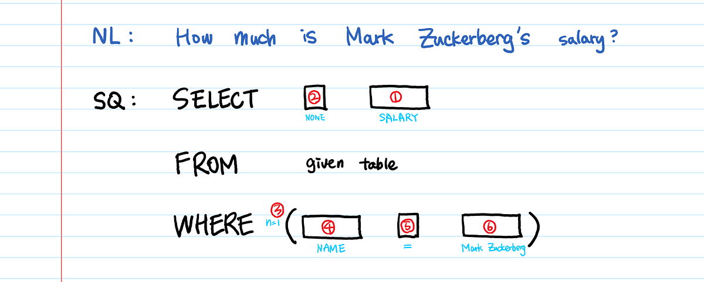

## Introduction
The Text-to-SQL Service allows users to interact with a database using natural language questions, translating them into SQL queries using the LLaMA model with few-shot learning. This project aims to make database querying more accessible, especially for non-technical users or those without SQL knowledge.



---
## How It Works

The project leverages LLaMA’s capabilities in natural language understanding and generation. When a user enters a question, the system:

1. Processes the question in natural language.
2. Converts the question to SQL syntax via LLaMA and few-shot learning examples.
3. Runs the generated SQL query against a database (currently SQLite).
4. Returns the query results to the user.
   
This process allows complex interactions with databases to be simplified into user-friendly questions.

---
## Key Components
**Flask Web Application**: Handles user input, interacts with the LLaMA model, and displays results.
**LLaMA-based Text-to-SQL Conversion**: Converts natural language queries into SQL commands.
**Database Integration (SQLite)**: An example database for testing; easily adaptable for other databases.

---
## Applications
**Business Analytics**: Allow non-technical team members to query data for reports.
**Educational Tools**: Helps students learn database querying by translating questions to SQL.
**Data Science & Engineering**: Rapid access to SQL data without manually writing queries.

---
## Project Structure
```perl
Text-to-SQL/
│
├── assets/                     # Folder for images, diagrams, and documentation
│   └── example_query.png       # Example of a natural language query and corresponding SQL
│
├── code/
│   ├── main.py                 # Main application file
│   ├── llm.py                  # Code for interacting with LLaMA model
│   ├── database.py             # Database connection and query execution
│   └── few_shot_examples.py    # File containing few-shot examples for SQL generation
├── data/
│   ├── database.db      # Example SQLite database for testing 
│
├── requirements.txt            # List of required packages
└── README.md                   # Project documentation
```
---

## Getting Started
To get the project up and running:

1. Clone the repository and set up the environment.
2. Install dependencies (see requirements.txt).
3. Run the Flask application to start the text-to-SQL service.

## License
This project is licensed under the Apache License 2.0. See the LICENSE file for more details.
